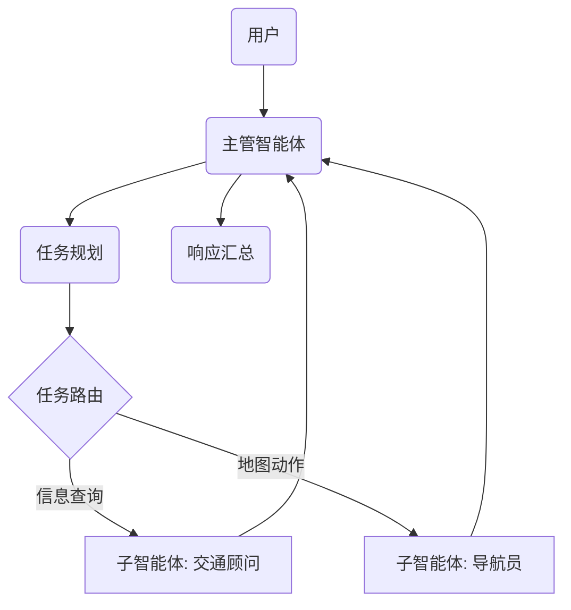

# ITS 多智能体系统架构升级与演进规划书 (v1.0)

## 1. 概述 (Executive Summary)
本文档旨在制定 ITS 多智能体系统从“Demo 级原型”向“工业级分层多智能体系统”演进的战略计划。本次升级重点解决当前架构存在的流程僵化、状态管理薄弱等问题，通过引入 **分层自治 (Hierarchy & Autonomy)**、**自我纠错 (Self-Correction)** 和 **人机协作 (HITL)** 等机制，显著提升系统的鲁棒性与智能化水平。

## 2. 现状分析 (As-Is Analysis)

| 组件模块 | 当前实现方案 | 存在的局限性 (痛点) | 升级策略 |
| :--- | :--- | :--- | :--- |
| **编排器 (Orchestrator)** | 线性 DAG 有向无环图<br>(`Intent` -> `Slot` -> `Dispatch` -> `Verify`) | 单点逻辑复杂，缺乏规划能力；<br>无法处理跨领域的复杂多步骤任务。 | **重构** 为 Supervisor (主管) 节点，负责规划与分发。 |
| **工具层 (Tools)** | 简单的函数调用 (Function Calls) | “发后即忘”。如果工具调用失败，无法重试；<br>如果结果不好，缺乏反思机制。 | **封装** 为独立的 Sub-Agent (子智能体) 图。 |
| **状态管理 (State)** | 扁平的 `AgentState` (仅消息列表) | 在复杂长任务中容易丢失上下文；<br>无法区分“全局规划”与“局部执行”状态。 | **升级** 为分层状态管理 (Global vs Local)。 |
| **流式输出 (Streaming)** | 原始 Token/日志流 | 用户看到的日志杂乱无章；<br>无法区分“思考过程”与“最终答案”。 | **重设计** 为结构化流式输出协议。 |

## 3. 目标架构设计 (To-Be Architecture)

### 3.1 拓扑结构：Supervisor-Worker 分层模式
我们将采用业界领先的 **Supervisor (主管-工人)** 模式。



### 3.2 核心组件定义

#### A. 主管智能体 (Supervisor - The Brain)
*   **核心职责**: 负责与用户对话、高层任务规划 (Planning)、任务分发 (Delegation) 和 结果验收。
*   **关键逻辑**:
    *   维护全局状态 `GlobalState`。
    *   使用 **ReAct** 或 **Plan-and-Solve** 提示词将用户问题拆解为 `task_queue` (任务队列)。
    *   根据队列中的首个任务，决策“该派谁去干活”。

#### B. 子智能体：交通顾问 (Traffic Researcher - The Scholar)
*   **核心职责**: 处理所有涉及“信息检索”的任务 (RAG 知识库 + Web 搜索)。
*   **内部流程 (Sub-Graph)**:
    *   `优化查询` -> `执行检索 (RAG/Web)` -> `评估文档质量` -> `生成答案`
    *   **自我纠错循环**: 如果 `评估文档质量` 不合格 -> `改写查询词` -> `重试` (最多 3 次)。

#### C. 子智能体：导航员 (Navigator - The Pilot)
*   **核心职责**: 处理地图 API 交互 (POI 查询, 路线规划, 实时路况)。
*   **内部流程 (Sub-Graph)**:
    *   `参数检查` -> (参数缺失?) -> `挂起并询问用户` -> `等待`
    *   `参数检查` -> (参数齐备?) -> `调用地图工具` -> `验证结果`

### 3.3 数据契约 (Data Contracts)

为了保证层级间通信的稳定性，必须使用严格类型定义：

**1. 全局状态 (GlobalState - 主管持有)**
```python
class GlobalState(TypedDict):
    messages: List[BaseMessage]  # 全局对话历史
    user_profile: dict           # 用户画像
    plan: List[str]              # 高层任务清单 (ToDo List)
    current_task: str            # 当前正在处理的任务
    final_response: str          # 准备流式输出给用户的最终答案
    next_agent: str              # 下一步路由目标: 'Researcher', 'Navigator', 或 'END'
```

**2. 子智能体状态 (SubAgentState - 工人共享 Schema)**
```python
class SubAgentState(TypedDict):
    # 输入 (来自 Supervisor)
    task_description: str        # 具体任务描述
    constraints: List[str]       # 约束条件 (如: "只查北京地区")
    
    # 内部工作记忆
    internal_messages: List[BaseMessage] # 子智能体内部的思考过程
    tool_outputs: List[dict]             # 工具调用原始结果
    retry_count: int                     # 重试计数器
    
    # 输出 (返回给 Supervisor)
    status: Literal["success", "failure", "need_user_input"]
    result: str                          # 任务执行结果摘要
```

## 4. 渐进式实施路线图 (Phased Roadmap)

为了控制风险，我们将升级计划分为三个严格的阶段。**上一阶段通过 L2 测试后，方可启动下一阶段。**

### 第一阶段 (Phase 1): 架构拆分与地基重构 (预计 2-3 天)
*   **目标**: 建立新的目录结构，实现 Supervisor 节点的基础调度逻辑。
*   **关键任务**:
    1.  创建 `backend/app/multi_agent/new_architecture/` 目录结构。
    2.  定义并实现 `GlobalState` 和 `SubAgentState` 数据结构。
    3.  实现一个基础的 `Supervisor` 节点，能够将任务路由给简单的“Mock Agent” (占位符)。
*   **交付物**: 一个能跑通“路由逻辑”的 LangGraph 原型 (虽然还没法真正干活)。
*   **验收标准**: 单元测试覆盖路由逻辑，确认意图识别正确。

### 第二阶段 (Phase 2): 打造“交通顾问”子智能体 (预计 3-4 天)
*   **目标**: 将 RAG 和搜索逻辑迁移到全新的子图架构中。
*   **关键任务**:
    1.  实现 `TrafficResearcher` 子图。
    2.  迁移 `es_retrieval_service` 调用逻辑。
    3.  **核心升级**: 增加 **Self-Correction (自我纠错)** 循环节点。
*   **交付物**: 一个具备“搜不到就自动重试”能力的智能体。
*   **验收标准**: 通过 L3-场景A (知识库问答) 测试，准确率优于老版本。

### 第三阶段 (Phase 3): 打造“导航员”与人机协同 (预计 3-4 天)
*   **目标**: 迁移地图工具，并实现复杂的人机交互。
*   **关键任务**:
    1.  实现 `Navigator` 子图。
    2.  **核心升级**: 增加 **参数校验循环** (HITL)。如果用户要去“万达”，Agent 必须追问“哪个万达？”。
    3.  将 Supervisor 与两个子智能体通过 `CompiledGraph` 进行集成。
*   **交付物**: 完整的 ITS 多智能体系统，支持“先查路况，再规划路线”的复合任务。
*   **验收标准**: 通过 L3-场景B (智能出行) 测试。

## 5. 风险评估与应对 (Risk Assessment)

| 风险点 | 影响程度 | 应对措施 |
| :--- | :--- | :--- |
| **系统复杂度爆炸** | 调试困难 | 深度集成 **LangSmith**，为每个子图设置独立的 Trace Group，确保可视化调试。 |
| **响应延迟增加** | 体验下降 | 在 Supervisor 层实现 **异步并行 (Async/Parallel)** 调度，允许“一边查资料，一边规划路线”。 |
| **Token 消耗增加** | 成本上升 | 内部循环 (Internal Loop) 使用便宜的小模型 (如 `qwen-turbo`)，仅在最终决策使用大模型。 |