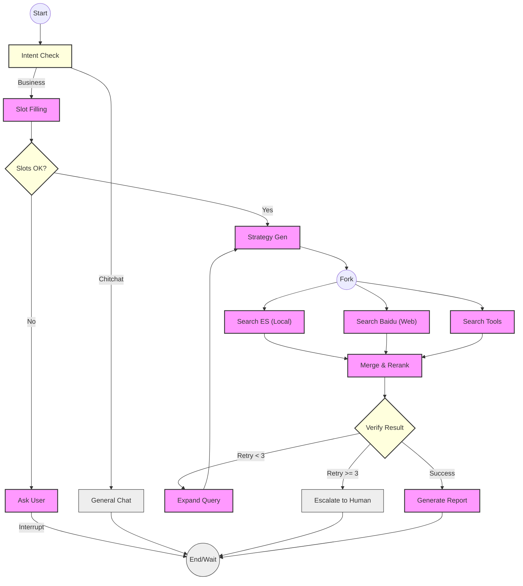

# 工业级 ITS 智能运维编排引擎技术方案 (Implementation Design)

| 文档版本 | 修改日期 | 状态 | 作者 | 变更内容 |
| :--- | :--- | :--- | :--- | :--- |
| v1.0 | 2026-01-28 | 已归档 | 架构师 | 初始版本 |
| v1.1 | 2026-01-28 | 已归档 | 架构师 | 补充错误处理、可观测性、并行执行及持久化优化 |
| v1.2 | 2026-01-28 | 已归档 | 架构师 | 新增功能规格说明书与全量回归测试策略 |
| v1.3 | 2026-01-28 | **现行有效** | 架构师 | **补充 LangGraph 节点与边的详细定义及流程图** |

---

## 1. 核心决策与架构原则 (Core Decision)

经过架构评审，我们决定放弃完全自研 FSM 引擎，转而采用 **LangGraph** 作为底层的编排框架。

### 1.1 为什么选择 LangGraph？
1.  **原生图结构支持**：LangGraph 天生支持循环（Cyclic）图结构，完美契合我们需要的 `SlotFilling -> AskUser -> SlotFilling` 闭环逻辑。
2.  **内置持久化 (Persistence)**：通过 `Checkpointer` 机制，自动解决长会话的状态保存与恢复（Resume），原生支持“断点续传”。
3.  **人机协同 (HITL)**：提供标准的 `interrupt_before` / `interrupt_after` 钩子，能够轻松实现“请求人工介入”的功能。
4.  **生态标准**：与 LangSmith 深度集成，能够自动生成可视化的状态拓扑图，极大降低调试和运维成本。

### 1.2 架构原则：LangGraph Inside, Strict Logic Outside
为了保证工业级的可控性，我们采取以下开发原则：
*   **严禁隐式路由**：所有的状态流转（Edges）必须由代码中的明确逻辑控制，**严禁**让 LLM 只有“下一步去哪”的自由裁量权（除非是明确的意图分类）。
*   **强类型状态**：State Schema 必须严格定义，禁止使用无结构的 Dict 传递核心业务数据。
*   **节点原子化**：每个 Node 只负责单一职责（如：只做校验，只做检索），便于单元测试。

---

## 2. 系统功能规格说明书 (Functional Specifications)

系统迁移至 LangGraph 后，必须确保以下 **6 大核心功能** 完好无损且性能更优。

### 2.1 实时信息检索 (Real-time Search)
*   **功能**: 通过 `search_mcp_client` 接入互联网搜索引擎。
*   **场景**: 天气查询、新闻资讯、产品发布日期等时效性强的问题。
*   **验收标准**: 必须返回 24 小时内的最新信息，且包含来源引用。

### 2.2 故障诊断与技术咨询 (Technical Troubleshooting)
*   **功能**: 基于 `knowledge_base` 和 `technical_agent` 的深度问答。
*   **场景**: 蓝屏错误码分析、软件配置指南、硬件故障排查。
*   **验收标准**: 准确识别错误码（如 0x0000007B），召回匹配的知识库文档，步骤清晰。

### 2.3 POI 导航与位置服务 (POI & Navigation)
*   **功能**: 集成 `baidu_mcp_client`。
*   **场景**: 查找周边设施（加油站、商场）、生成从 A 到 B 的导航路线。
*   **验收标准**: 能够处理模糊地名，返回带距离、评分的 POI 列表，导航链接有效。

### 2.4 服务站查询 (Service Station Query)
*   **功能**: 基于 IP 或用户输入位置，查找官方授权服务站。
*   **场景**: "最近的联想维修点在哪"。
*   **验收标准**: 距离排序准确，包含电话、营业时间等元数据。

### 2.5 复杂意图拆解 (Multi-hop Orchestration)
*   **功能**: 将复合指令拆解为有序或并行的子任务。
*   **场景**: "先帮我查下这台电脑保修期过了没，没过的话帮我预约最近的维修站"。
*   **验收标准**: 能够正确传递上下文（保修状态 -> 决定是否找维修站）。

### 2.6 多轮会话与记忆保持 (Multi-turn Context & Memory)
*   **功能**: 基于 `ThreadID` 的长短期记忆管理。
*   **核心能力**:
    *   **指代消解**: 识别 "它"、"那个地方" 指代的是上一轮的实体。
    *   **槽位继承**: 后续对话自动继承之前的 `os_version`、`device_model` 等信息。
    *   **状态恢复**: 会话中断后（如第二天）能从断点（Checkpoint）无缝继续。
*   **验收标准**: 跨多轮对话的意图切换自然，无信息丢失。

---

## 3. LangGraph 节点与边定义 (Graph Nodes & Edges)

### 3.1 节点定义 (Nodes)
我们将业务逻辑拆解为以下 **12 个原子节点**：

| 节点名称 | 职责 (Responsibility) | 输入 (Input) | 输出 (Update) |
| :--- | :--- | :--- | :--- |
| **node_intent** | 意图识别 | `messages` | `current_intent`, `intent_confidence` |
| **node_slot_filling** | 槽位提取与校验 | `messages`, `current_intent` | `slots`, `missing_slots` |
| **node_ask_user** | 生成追问话术 | `missing_slots` | `messages` (Question) |
| **node_general_chat** | 通用闲聊 | `messages` | `messages` (Answer) |
| **node_strategy_gen** | 生成检索/工具策略 | `current_intent`, `slots` | `retrieval_strategy` |
| **node_search_es** | (并行) 本地 ES 检索 | `retrieval_strategy` | `retrieved_documents` (partial) |
| **node_search_baidu** | (并行) 百度 MCP 检索 | `retrieval_strategy` | `retrieved_documents` (partial) |
| **node_search_tools** | (并行) 其它工具调用 | `retrieval_strategy` | `retrieved_documents` (partial) |
| **node_merge_rerank** | (汇聚) 结果融合与重排 | `retrieved_documents` | `retrieved_documents` (sorted) |
| **node_verify** | 结果质量校验 | `retrieved_documents` | `need_human_help`, `retry_count` |
| **node_expand_query** | 扩搜策略生成 | `retry_count` | `retrieval_strategy` (relaxed) |
| **node_escalate** | 转人工服务 | `messages`, `error_log` | `messages` (Handoff summary) |
| **node_generate_report** | 生成最终回答 | `retrieved_documents` | `messages` (Final Report) |

### 3.2 边与路由定义 (Edges & Routing)

我们使用 **Conditional Edges** 实现动态流转：

| 起始节点 | 路由函数 (Router) | 条件与目标 (Conditions -> Target) |
| :--- | :--- | :--- |
| **START** | - | -> `node_intent` |
| **node_intent** | `route_intent` | "chitchat" -> `node_general_chat`<br>"tech/poi/service" -> `node_slot_filling` |
| **node_slot_filling** | `route_slot_check` | 缺槽位 -> `node_ask_user`<br>槽位全 -> `node_strategy_gen` |
| **node_ask_user** | - | -> **END** (中断，等待用户输入) |
| **node_strategy_gen** | `route_parallel_execution` | -> [`node_search_es`, `node_search_baidu`, `node_search_tools`] (Fan-Out) |
| **[Search Nodes]** | - | -> `node_merge_rerank` (Fan-In) |
| **node_merge_rerank** | - | -> `node_verify` |
| **node_verify** | `route_verify_result` | 结果OK -> `node_generate_report`<br>结果空 & Retry<3 -> `node_expand_query`<br>结果空 & Retry>=3 -> `node_escalate` |
| **node_expand_query** | - | -> `node_strategy_gen` (Loop) |
| **node_escalate** | - | -> **END** |
| **node_generate_report** | - | -> **END** |
| **node_general_chat** | - | -> **END** |

### 3.3 状态流转拓扑图 (Mermaid Visualization)

**核心设计说明**：
1.  **START/END**: 标准入口与出口。
2.  **分支与并行 (Fork & Join)**: `node_strategy_gen` 分裂出三路并行搜索，最终汇聚于 `node_merge_rerank`。
3.  **循环 (Loops)**:
    *   **Loop 1 (Ask User)**: `node_slot_filling` <--> `node_ask_user`，这是与用户的交互循环。
    *   **Loop 2 (Retry)**: `node_verify` --> `node_expand_query` --> `node_strategy_gen`，这是内部的检索优化循环。



---

## 4. 详细数据结构定义 (State Schema)

```python
from typing import TypedDict, Annotated, List, Dict, Optional, Any
from langchain_core.messages import BaseMessage
import operator

class RetrievalStrategy(TypedDict):
    """检索策略配置"""
    intent_type: str        # 意图类型
    keyword_weight: float   # BM25 权重
    vector_weight: float    # 向量权重
    search_kwargs: Dict[str, Any] 

class DiagnosisStep(TypedDict):
    step_index: int
    action: str
    observation: str
    status: str 

class AgentState(TypedDict):
    """
    核心状态对象 (The Blackboard)
    """
    # --- 基础通信 (支持多轮对话) ---
    # Annotated[..., operator.add] 确保消息是追加而非覆盖
    messages: Annotated[List[BaseMessage], operator.add]
    
    # --- 上下文信息 ---
    session_id: str
    user_id: str
    trace_id: str
    
    # --- 业务状态 ---
    current_intent: Optional[str] 
    intent_confidence: float
    
    # --- 槽位管理 (Context Retention) ---
    # 这里的 slots 会在多轮对话中持久化
    slots: Dict[str, Any]
    missing_slots: List[str]
    ask_user_count: int
    
    # --- 检索与执行 ---
    retrieval_strategy: Optional[RetrievalStrategy]
    retrieved_documents: List[Any]
    steps: List[DiagnosisStep]
    
    # --- 错误处理 ---
    error_log: List[str] 
    retry_count: int     
    
    # --- 结果控制 ---
    need_human_help: bool
    final_report: Optional[Dict[str, Any]]
```

---

## 5. 全量回归测试策略 (Regression Test Suite)

为保证 6 大功能的平稳迁移，执行以下测试矩阵。

### 5.1 功能回归矩阵

| ID | 模块 | 测试场景 | 输入流 (Input Stream) | 预期结果 (Expected Outcome) |
| :--- | :--- | :--- | :--- | :--- |
| **F01** | Search | 实时性 | "今天北京天气" | 调用 Search 工具，返回今日数据 |
| **F02** | KB | 精准排查 | "Win10 蓝屏 0x7B" | 命中 KB，返回 0x7B 解决方案 |
| **F03** | POI | 模糊搜 | "附近好吃的" | 调用 BaiduMap，返回 POI 列表 |
| **F04** | Station | 最近网点 | "海淀区最近的联想维修" | 返回具体服务站信息 |
| **F05** | Multi-hop | 串行任务 | "先查天气，如果是雨天找维修点" | 依次执行 Search -> Logic -> Station |

### 5.2 多轮会话与记忆测试 (Session & Memory)

| ID | 场景 | 轮次 | 输入 | 预期行为 | 验证点 |
| :--- | :--- | :--- | :--- | :--- | :--- |
| **M01** | **指代消解** | T1 | "查一下鸟巢的门票" | 返回鸟巢信息 | 实体识别: 鸟巢 |
| | | T2 | "**它**周一开门吗？" | 查询鸟巢周一状态 | **Core Ref**: 它 -> 鸟巢 |
| **M02** | **槽位修正** | T1 | "电脑无法开机" | 追问型号 | State: SlotFilling |
| | | T2 | "是戴尔的" | 记录 Brand=Dell | State: slots updated |
| | | T3 | "不对，是惠普" | 更新 Brand=HP | State: slots overwritten |
| **M03** | **状态恢复** | T1 | "报错 0x800" (中断) | 系统记录 State | Checkpoint 保存成功 |
| | | T2 | (1小时后) "4005" | 合并为 0x8004005 | 从 Checkpoint 恢复并补全 |

### 5.3 鲁棒性与异常测试

| ID | 场景 | 模拟条件 | 预期结果 |
| :--- | :--- | :--- | :--- |
| **E01** | **空结果重试** | Mock Search 返回 [] | Trace 显示触发 `Node_Expand`，最终返回兜底文案 |
| **E02** | **死循环熔断** | 连续 5 次检索无效 | 触发 `Node_Escalate`，返回转人工提示 |
| **E03** | **并发隔离** | 两个 Session 同时发请求 | Session A 和 B 的槽位互不干扰 |

---

## 6. 开发实施路径 (Updated)

1.  **Phase 1: 核心链路与状态定义**
    *   搭建 LangGraph 骨架，定义 `AgentState`。
    *   实现 `Intent` -> `Slot` -> `AskUser` 闭环。
2.  **Phase 2: 核心功能节点迁移**
    *   迁移 Search, KB, POI, Station 四大工具到 Graph Node。
    *   实现 `Strategy` 和 `Parallel` 逻辑。
3.  **Phase 3: 多轮会话与持久化**
    *   接入 `MemorySaver` (Dev) / `Redis` (Prod)。
    *   **重点**: 调试 `thread_id` 机制，跑通 M01-M03 用例。
4.  **Phase 4: 全量回归与压测**
    *   运行自动化测试脚本，覆盖 F01-F05 及 E01-E03。