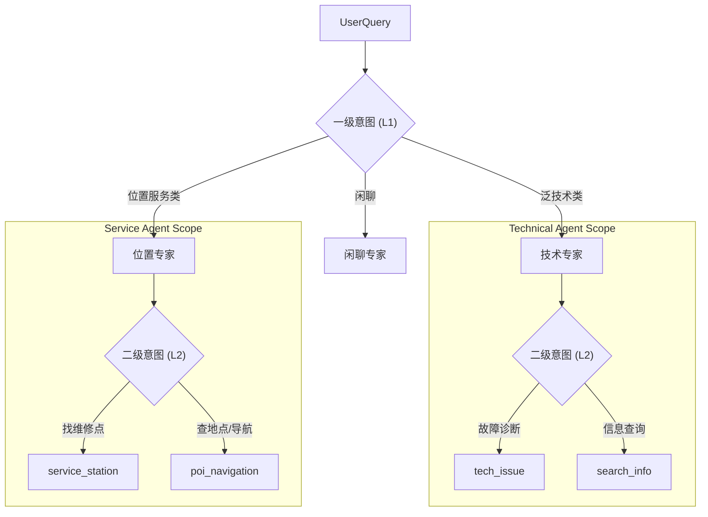

# 工业级 ITS 多智能体架构与意图体系设计文档

| 文档版本 | 日期 | 作者 | 状态 |
| :--- | :--- | :--- | :--- |
| v1.0 | 2026-01-28 | 架构师 | Draft |

---

## 1. 设计目标
构建一个清晰、解耦、可扩展的**工业级多智能体系统 (Industrial MAS)**。
通过**分层意图体系 (Hierarchical Intent System)** 和 **专职智能体 (Specialized Agents)** 的配合，实现对用户需求的精准路由和高效执行。

---

## 2. 多智能体角色定义 (Agent Roles)

我们将系统划分为 **1 个调度器 + 3 个专家智能体** 的星形架构。

### 2.1 🧠 调度智能体 (Orchestrator Agent)
*   **职责**：系统的“前台”。负责接收用户输入，进行一级意图识别，将任务分发给下游专家，并负责最终结果的汇总。
*   **核心能力**：意图分类、任务拆解、多跳任务编排。
*   **对应节点**：`node_intent`

### 2.2 🛠️ 技术专家智能体 (Technical Agent)
*   **职责**：负责解决所有泛技术类问题。既包含深度的故障诊断，也包含广度的信息查询。
*   **核心能力**：
    *   **深度诊断**：基于知识库 (RAG) 解决设备故障。
    *   **广度搜索**：基于联网搜索解决实时资讯问题。
    *   **槽位管理**：维护设备型号、系统版本等上下文。
*   **对应节点**：`node_slot_filling`, `node_strategy_gen`

### 2.3 📍 服务与位置智能体 (Service & POI Agent)
*   **职责**：负责所有与“地理位置”相关的服务。
*   **核心能力**：
    *   **LBS 查询**：查找最近的服务站。
    *   **导航规划**：调用地图 API 生成路线。
*   **对应节点**：`node_search_tools`, `node_search_baidu` (部分)

### 2.4 💬 闲聊智能体 (Chitchat Agent)
*   **职责**：处理非业务类对话，提供情感陪伴。
*   **对应节点**：`node_general_chat`

---

## 3. 分层意图体系设计 (Hierarchical Intent Schema)

为了提高识别准确率并复用 Agent 能力，我们采用 **二级意图结构**。

### 3.1 意图架构图

### 3.2 意图详细定义表

| 归属 Agent | 一级意图 (L1) | 二级意图 (L2) | 定义与特征 | 关键处理差异 |
| :--- | :--- | :--- | :--- | :--- |
| **Technical** | `technical` | **`tech_issue`** | **故障诊断** 特征：报错、蓝屏、配置、操作指南 示例："电脑开机黑屏" | **必须进 Slot Filling** 策略：重 KB (0.8), 轻 Web (0.2) |
| **Technical** | `technical` | **`search_info`** | **通用资讯** 特征：天气、股价、新闻、百科 示例："今天北京天气" | **跳过 Slot Filling** 策略：重 Web (0.9), 轻 KB (0.1) |
| **Service** | `location` | **`service_station`** | **服务站查询** 特征：找售后、维修点 示例："最近的联想售后" | **调用本地 DB 工具** 需用户位置信息 |
| **Service** | `location` | **`poi_navigation`** | **POI 导航** 特征：找加油站、商场、路线 示例："导航去天安门" | **调用百度地图 MCP** 需调用 Map API |
| **Chitchat** | `chitchat` | - | **闲聊** 特征：问候、无意义对话 | 直接回复，不调用工具 |

---

## 4. 路由与执行逻辑 (Routing Logic)

### 4.1 调度层的路由 (L1 Routing)
*   **输入**：用户 Query
*   **判断**：
    *   如果是“修电脑”或“查天气” -> 转给 **Technical Agent**。
    *   如果是“找地方”或“去哪里” -> 转给 **Service Agent**。
    *   如果是“你好” -> 转给 **Chitchat Agent**。

### 4.2 专家层的路由 (L2 Routing)

#### Technical Agent 内部逻辑：
*   收到任务后，判断是 `tech_issue` 还是 `search_info`。
*   **Branch A (`tech_issue`)**: 进入 `SlotFilling` 循环，强制追问设备信息。
*   **Branch B (`search_info`)**: **Bypass (绕过)** 槽位检查，直接进入 `StrategyGen` 生成搜索策略。

#### Service Agent 内部逻辑：
*   收到任务后，判断是找 `service_station` 还是 `poi`。
*   **Branch A (`service_station`)**: 构造查询 SQL，查本地库。
*   **Branch B (`poi`)**: 构造地图 API 请求，查百度地图。

---

## 5. 总结

这种 **"1+3" 架构** 和 **"两级意图"** 设计的优势在于：
1.  **高内聚**：查天气和修电脑都需要“搜索能力”，所以归给 Technical Agent 统一管理能力，但在内部通过 L2 意图区分流程。
2.  **低耦合**：调度器只需要知道“这是个技术活”还是“这是个体力活（跑腿）”，不需要关心具体的执行细节。
3.  **灵活扩展**：如果未来要加一个“订票”功能，只需要加一个 `Booking Agent` 和对应的 L1 意图，不影响现有逻辑。
