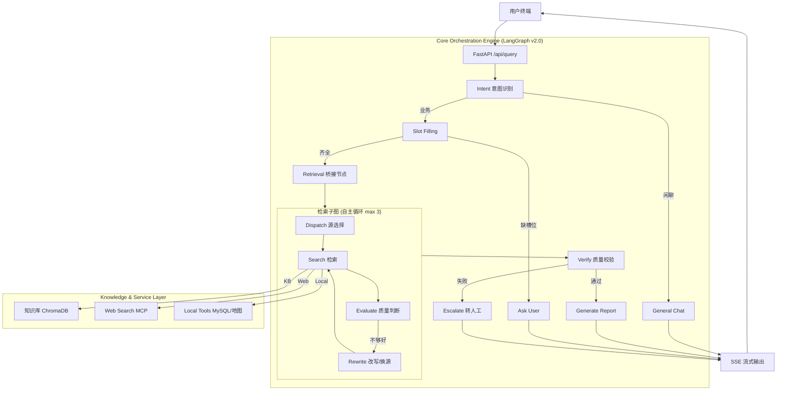

# 工业级 ITS 智能运维编排引擎详细设计文档 (Detailed Design Document)

| 文档版本 | 修改日期 | 修改人 | 备注 |
| :--- | :--- | :--- | :--- |
| v1.0 | 2026-01-28 | 架构师 | 初始化状态机与动态检索策略设计 |
| v2.0 | 2026-01-28 | 架构师 | 升级为工业级架构，增加数据闭环、安全合规、人机协同等模块 |
| v3.0 | 2026-02-23 | 架构师 | **同步 v2.0 混合架构：检索子图自主循环替代 StrategyGen 硬编码分发** |

---

## 1. 业务背景与技术挑战 (Background & Challenges)

### 1.1 核心痛点
当前的 ITS 智能体初步具备了对话能力，但在面对企业级真实场景时，显得“脆弱”且“不可控”：
1.  **不可控性 (Uncontrollability)**：完全依赖 LLM 的概率性输出，导致在收集关键故障信息（如“型号”、“错误码”）时经常遗漏，且容易产生幻觉。
2.  **数据割裂 (Open Loop)**：Agent 的每一次交互都是孤立的，缺乏“负反馈机制”。线上发生的 Bad Case 无法自动转化为知识库的更新或 Prompt 的优化。
3.  **安全隐患 (Security Risks)**：缺乏对敏感数据（PII）的过滤，且对 Prompt Injection 攻击缺乏防御。
4.  **运维盲区 (Observability Gap)**：缺乏端到端的全链路追踪，无法量化 Agent 的“思考过程”和“耗时瓶颈”。

### 1.2 设计目标
构建一个 **"可信、可控、可进化"** 的工业级智能编排引擎。

*   **业务合规率**：100%（通过 FSM 强制状态流转，杜绝核心步骤跳过）。
*   **检索准确率 (Recall@5)**：提升 40%（通过动态权重策略 + 语义重排）。
*   **数据闭环**：实现 "Feedback -> Evaluation -> Finetune/KB Update" 的自动化流程。
*   **系统延迟 (P99)**：< 500ms (首字生成)，< 2s (完整回复，复杂任务除外)。

---

## 2. 系统总体架构 (System Architecture)

系统采用 **分层治理架构 (Layered Governance Architecture)**，将“概率性的 AI” 关进 “确定性的工程笼子”里。



---

## 3. 核心模块详细设计 (Module Design)

### 3.1 确定性编排引擎 (LangGraph Pipeline Orchestrator)

采用 **LangGraph 显式管道** 管理核心业务流，确保流程的**确定性**，同时在检索环节嵌入自主循环子图提供**智能性**。

#### 3.1.1 主图节点定义
*   **INTENT**: 意图识别与分类（L1→L2 二级分类：tech_issue, search_info, service_station, poi_navigation, chitchat）。
*   **SLOT_FILLING**: 强制信息收集。根据意图提取所需槽位（如 `problem_description`, `device_model`）。若缺失，路由到 `ASK_USER`。
*   **ASK_USER**: 生成追问话术，最多 3 轮后自动升级人工。
*   **RETRIEVAL**: 桥接节点，运行检索子图（dispatch→search→evaluate→rewrite 循环，max 3 次）。
*   **VERIFY**: LLM 质量判断，检索结果是否匹配用户问题。不合格时清空文档触发 escalate。
*   **GENERATE_REPORT**: 综合检索结果生成最终答案。
*   **ESCALATE**: 转人工客服，设置 `need_human_help=True`。

#### 3.1.2 检索子图自主循环
检索子图内部实现 **evaluate→rewrite** 循环，替代原有的 `STRATEGY_GEN` 硬编码分发：
*   **dispatch**: 根据意图映射首选数据源（tech_issue→kb, search_info→web, service_station/poi_navigation→local_tools）
*   **search**: 执行实际检索（KB/Web/LocalTools）
*   **evaluate**: LLM 判断结果质量，返回 suggestion（pass/retry_same/switch_source）
*   **rewrite**: 改写 query 或切换数据源（kb↔web）
*   **确定性兜底**: 最多循环 3 次，超限强制退出

#### 3.1.3 异常熔断机制
*   **追问上限**: `ask_user_count` 最多 3 次，超限时节点设置 `need_human_help=True`，由 `route_ask_user_result` 条件边路由到 `escalate`。
*   **检索上限**: 子图 `max_retries=3`，超限强制退出带降级标记。
*   **会话持久化**: 支持 Redis checkpointer（生产）或 MemorySaver（开发）。

### 3.2 主动检索协议 (Active Retrieval Protocol)

检索环节已从硬编码的 `STRATEGY_GEN` 分发升级为**检索子图自主循环**。子图内部的 `evaluate` 节点由 LLM 判断结果质量，`rewrite` 节点负责改写 query 或切换数据源。

#### 3.2.1 数据源映射策略

在子图 `dispatch` 节点中，根据 L2 意图自动选择首选数据源：

| L2 意图 | 首选数据源 | 兜底策略 | 适用案例 |
| :--- | :--- | :--- | :--- |
| **tech_issue** | KB (知识库) | evaluate 不通过 → 切换 Web | “电脑蓝屏怎么办” |
| **search_info** | Web (联网搜索) | — (Web 为最终数据源) | “今天北京天气” |
| **service_station** | Local Tools (MySQL) | — | “最近的联想售后” |
| **poi_navigation** | Local Tools (MCP 地图) | — | “导航去天安门” |

#### 3.2.2 自主循环机制
```
dispatch → search → evaluate → (sufficient?) → exit
                       ↓ (not sufficient)
                    rewrite → search → evaluate → ...  (max 3 loops)
```
*   **evaluate** 返回: `is_sufficient` (bool) + `suggestion` (pass/retry_same/switch_source)
*   **rewrite** 执行: switch_source 时切换 kb↔web，否则 LLM 改写 query
*   **确定性兜底**: `loop_count >= max_retries(3)` 时强制退出

### 3.3 数据闭环系统 (Data Closed Loop)

这是区别于 Demo 的关键，实现了系统的**自我进化**。

1.  **数据埋点**：
    *   **Trace ID**: 贯穿 API -> FSM -> LLM -> DB 全链路。
    *   **Feedback Endpoint**: 允许前端传入 `thumbs_up`, `thumbs_down` 及 `correction_text`。
2.  **Bad Case 挖掘**：
    *   **规则挖掘**: 检索结果为空、多轮交互未解决、用户负反馈。
    *   **模型挖掘**: 使用更强的模型 (e.g. GPT-4/Qwen-Max) 定期审计历史对话，评分 < 3 分的标记为 Bad Case。
3.  **闭环动作**：
    *   **知识库补缺**: 将 Bad Case 及其正确解法（人工或高阶模型生成）自动提炼为 Q&A 对，存入知识库“待审核区”。
    *   **Prompt 优化**: 分析 Slot Filling 失败的高频场景，优化提取 Prompt 的 Few-Shot 示例。

---

## 4. 安全与合规设计 (Security & Compliance)

### 4.1 输入/输出围栏 (Guardrails)
*   **PII 过滤**: 在发送给 LLM 前，使用正则或专门模型将 手机号、身份证、IP地址 等替换为 `<PHONE>`, `<ID_CARD>` 等占位符。
*   **Prompt 注入防御**: 检测输入中是否包含 "Ignore previous instructions" 等特征词。
*   **输出审计**: 检测 LLM 输出是否包含敏感词、竞争对手名称或不合规建议。

### 4.2 权限控制
*   **API 鉴权**: 基于 OAuth2 / JWT 的身份验证。
*   **RBAC**: 限制普通用户只能查询公开知识库，内部技术人员可查询机密文档。

---

## 5. 可观测性设计 (Observability)

### 5.1 结构化日志 (Structured Logging)
```json
{
  "trace_id": "tx_123456",
  "span_id": "span_789",
  "level": "INFO",
  "component": "Orchestrator",
  "event": "state_transition",
  "attributes": {
    "from": "slot_filling",
    "to": "retrieval",
    "slots_collected": {"device": "Server A", "error": "Disk Full"},
    "latency_ms": 450
  }
}
```

### 5.2 核心监控指标 (Metrics)
*   **Business Success Rate**: 最终诊断成功（无转人工）的比例。
*   **Slot Filling Efficiency**: 平均多少轮对话能填满槽位。
*   **Retrieval Zero Rate**: 检索结果为空的比例（反映知识库缺口）。
*   **Token Usage / Cost**: 按用户/租户维度的成本监控。

---

## 6. 接口协议规范 (API Specifications)

### 6.1 核心对话接口
`POST /api/query`
支持 **SSE (Server-Sent Events)** 流式输出，以降低用户感知的延迟。

**Response Stream Events:**
1.  `event: thought` -> 返回 Agent 的思考过程（状态机流转、使用的工具）。
2.  `event: message` -> 返回具体的对话文本。
3.  `event: diagnosis_report` -> 返回结构化的 JSON 报告（卡片展示）。
4.  `event: error` -> 系统异常信息。

---

## 7. 部署与运维 (Deployment & Ops)

*   **容器化**: Docker + K8s 部署，支持水平扩展。
*   **配置管理**: 通过 ConfigMap/Secret 管理 API Key 和 数据库连接串。
*   **CI/CD**: 代码提交触发 Unit Test -> Integration Test (Mock LLM) -> Deploy to Staging。