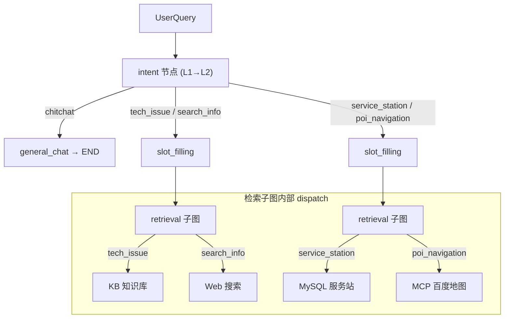

# 工业级 ITS 多智能体架构与意图体系设计文档

| 文档版本 | 日期 | 作者 | 状态 |
| :--- | :--- | :--- | :--- |
| v1.0 | 2026-01-28 | 架构师 | Draft |
| v2.0 | 2026-02-23 | 架构师 | **同步 v2.0 混合架构：更新节点映射与路由逻辑** |

---

## 1. 设计目标
构建一个清晰、解耦、可扩展的**工业级多智能体系统 (Industrial MAS)**。
通过**分层意图体系 (Hierarchical Intent System)** 和 **专职智能体 (Specialized Agents)** 的配合，实现对用户需求的精准路由和高效执行。

---

## 2. 多智能体角色定义 (Agent Roles)

在 v2.0 混合架构中，原有的”1+3 专家智能体”概念已演化为 **LangGraph 显式管道中的功能节点**。意图分类仍保留二级结构，但路由和执行由图拓扑显式控制，而非 Agent 自主决策。

### 2.1 意图识别层 (Intent Layer)
*   **职责**：接收用户输入，进行 L1→L2 二级意图分类，路由到对应的处理分支。
*   **对应节点**：`intent`（`nodes/intent_node.py`）
*   **路由函数**：`route_intent` — chitchat → general_chat，其余 → slot_filling

### 2.2 技术处理链 (Technical Pipeline)
*   **职责**：处理 `tech_issue` 和 `search_info` 两类意图。
*   **核心能力**：
    *   **深度诊断**：检索子图优先查 KB，evaluate 不通过自动切 Web
    *   **广度搜索**：检索子图优先查 Web，无兜底（Web 为最终数据源）
    *   **槽位管理**：`slot_filling` 节点提取 `problem_description`、`device_model`
*   **对应节点**：`slot_filling` → `retrieval`(子图) → `verify` → `generate_report`

### 2.3 位置服务链 (Location Pipeline)
*   **职责**：处理 `service_station` 和 `poi_navigation` 两类意图。
*   **核心能力**：
    *   **LBS 查询**：检索子图 dispatch 到 local_tools（MySQL 查服务站）
    *   **导航规划**：检索子图 dispatch 到 local_tools（MCP 百度地图）
*   **对应节点**：`slot_filling` → `retrieval`(子图) → `verify` → `generate_report`

### 2.4 闲聊处理 (Chitchat)
*   **职责**：处理非业务类对话，引导用户回到业务问题。
*   **对应节点**：`general_chat`（`nodes/general_chat_node.py`）

---

## 3. 分层意图体系设计 (Hierarchical Intent Schema)

为了提高识别准确率并复用 Agent 能力，我们采用 **二级意图结构**。

### 3.1 意图架构图

### 3.2 意图详细定义表

| 归属管道 | 一级意图 (L1) | 二级意图 (L2) | 定义与特征 | 关键处理差异 |
| :--- | :--- | :--- | :--- | :--- |
| **技术链** | `technical` | **`tech_issue`** | **故障诊断** 特征：报错、蓝屏、配置、操作指南 示例："电脑开机黑屏" | **必须 Slot Filling**（problem_description, device_model） 子图 dispatch → KB，兜底切 Web |
| **技术链** | `technical` | **`search_info`** | **通用资讯** 特征：天气、股价、新闻、百科 示例："今天北京天气" | **快速通过 Slot Filling**（无必填槽位） 子图 dispatch → Web，无兜底 |
| **位置链** | `location` | **`service_station`** | **服务站查询** 特征：找售后、维修点 示例："最近的联想售后" | **Slot Filling** 需 location 子图 dispatch → local_tools (MySQL) |
| **位置链** | `location` | **`poi_navigation`** | **POI 导航** 特征：找加油站、商场、路线 示例："导航去天安门" | **Slot Filling** 需 destination 子图 dispatch → local_tools (MCP 地图) |
| **闲聊** | `chitchat` | - | **闲聊** 特征：问候、无意义对话 | route_intent 直接走 general_chat → END |

---

## 4. 路由与执行逻辑 (Routing Logic)

### 4.1 主图路由：`route_intent`（L1→L2 一步到位）

`intent` 节点直接输出 L2 意图，`route_intent` 根据 L2 决定下一步：

*   `chitchat` → `general_chat` → END
*   `tech_issue` / `search_info` / `service_station` / `poi_navigation` → `slot_filling`

### 4.2 槽位路由：`route_slot_check`

*   有缺失槽位 → `ask_user`（追问，最多 3 轮）→ END（等待用户回复）；超限（count ≥ 3）→ `escalate`
*   槽位齐全 → `retrieval`（进入检索子图）

### 4.3 检索子图内部路由

L2 意图在子图 `dispatch` 节点中决定数据源：

*   `tech_issue` → KB 优先，evaluate 失败切 Web
*   `search_info` → Web 优先，无兜底（Web 为最终数据源）
*   `service_station` / `poi_navigation` → local_tools（MySQL / MCP 地图）

### 4.4 验证路由：`route_verify_result`

*   有检索结果 → `generate_report` → END
*   无结果（verify 清空） → `escalate` → END

---

## 5. 总结

**”二级意图 + 显式管道 + 检索子图”** 设计的优势：

1.  **统一管道**：所有业务意图共享同一条 slot_filling → retrieval → verify → report 管道，L2 意图仅影响子图内部的数据源选择。
2.  **智能检索**：子图 evaluate→rewrite 循环让模型自主决定改写 query 或切换数据源，替代原有硬编码兜底。
3.  **灵活扩展**：新增意图只需在 `intent_node` 添加 L2 分类 + 在子图 `dispatch` 添加数据源映射，不影响主图拓扑。
