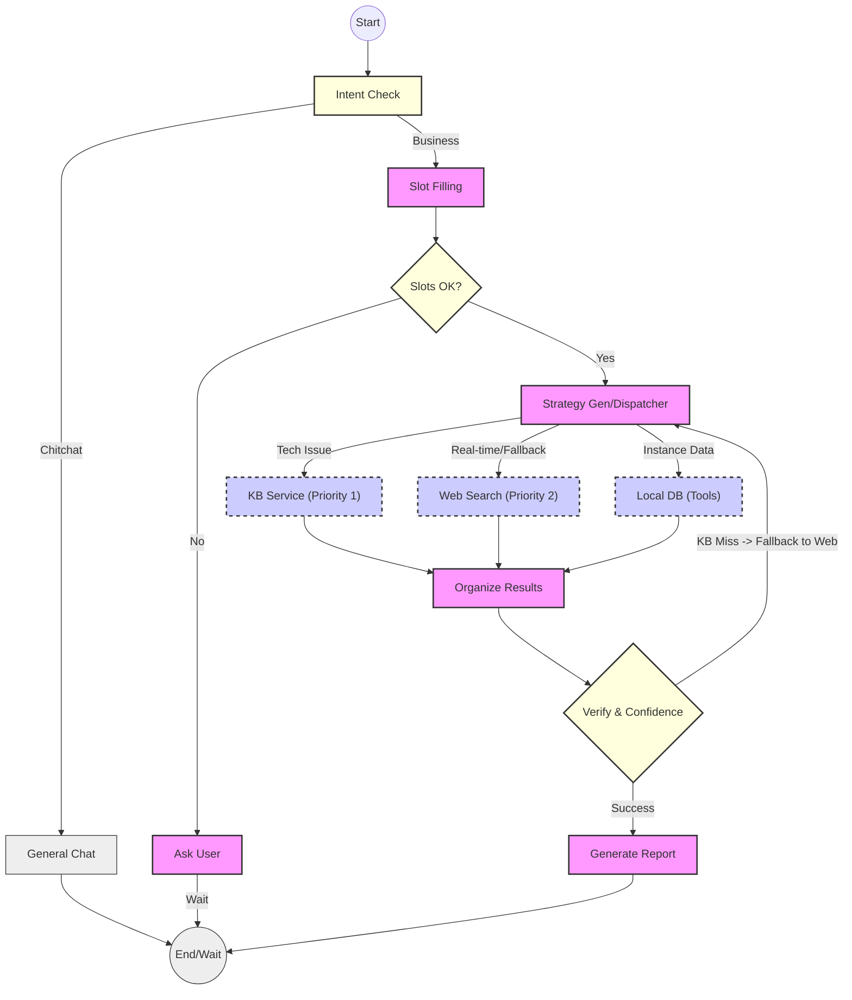

# 工业级 ITS 智能运维编排引擎技术方案 (Implementation Design)

| 文档版本 | 修改日期 | 状态 | 作者 | 变更内容 |
| :--- | :--- | :--- | :--- | :--- |
| v1.0 | 2026-01-28 | 已归档 | 架构师 | 初始版本 |
| v1.1 | 2026-01-28 | 已归档 | 架构师 | 补充错误处理、可观测性、并行执行及持久化优化 |
| v1.2 | 2026-01-28 | 已归档 | 架构师 | 新增功能规格说明书与全量回归测试策略 |
| v1.3 | 2026-01-28 | 已归档 | 架构师 | 补充 LangGraph 节点与边的详细定义及流程图 |
| v1.4 | 2026-01-28 | 已归档 | 架构师 | 新增会话与记忆管理设计 (State-First 理念) |
| v1.5 | 2026-01-29 | **现行有效** | 架构师 | **架构解耦优化：严格界定智能助手与知识库微服务边界** |

---

## 1. 核心决策与架构原则 (Core Decision)

经过架构评审，系统采用 **LangGraph** 作为底层的编排框架，严格遵循 **“Agent 做编排，微服务做业务”** 的解耦原则。

### 1.1 架构原则：Service-Oriented Orchestration
*   **职责边界**: 智能助手（Agent）负责理解用户意图、收集槽位、编排链路；知识库服务负责具体的检索算法（ES/向量）与重排。
*   **透明检索**: Agent 通过业务标签（Query Tags）驱动检索，不感知底层实现细节（权重、模型版本等）。
*   **状态强一致性**: 采用强类型 State Schema，确保长链路多轮对话中的上下文不丢失、不紊乱。

---

## 2. 系统功能规格说明书 (Functional Specifications)

### 2.1 核心业务能力
*   **精准技术支持**: 针对电脑维修、软件故障提供 SOP 级别的分步指导。
*   **实时信息聚合**: 结合 MCP 协议获取最新天气、资讯，实现时效性补全。
*   **位置与服务集成**: 集成百度地图能力，提供周边服务站导航及 POI 检索。

---

## 3. LangGraph 节点与边定义 (Graph Nodes & Edges)

### 3.1 节点定义 (Nodes)
我们将业务逻辑拆解为以下 **11 个原子节点**：

| 节点名称 | 职责 (Responsibility) | 输入 (Input) | 输出 (Update) |
| :--- | :--- | :--- | :--- |
| **node_intent** | 意图识别 | `messages` | `current_intent` |
| **node_slot_filling** | 语义槽位提取 | `messages` | `slots`, `missing_slots` |
| **node_ask_user** | 缺槽位追问话术生成 | `missing_slots` | `messages` (Question) |
| **node_general_chat** | 通用闲聊生成 | `messages` | `messages` (Answer) |
| **node_strategy_gen** | **(核心) 分发调度器** | `intent`, `slots` | `strategy` (含数据源与降级策略) |
| **node_search_kb** | 查询知识库 (First Choice) | `strategy` | `retrieved_documents` |
| **node_search_web** | 查询互联网 (Real-time & **KB Fallback**) | `strategy` | `retrieved_documents` |
| **node_search_tools** | 查询业务数据库 (Instance Data) | `strategy` | `retrieved_documents` |
| **node_organize_results** | 结果整理与格式化 | `retrieved_documents` | `retrieved_documents` (structured) |
| **node_verify** | 结果质量与置信度校验 | `documents` | `retry_count`, `need_human` |
| **node_generate_report** | 最终解决方案生成 | `documents` | `messages` (Final Report) |

### 3.2 边与路由定义 (Edges & Routing)

| 起始节点 | 路由函数 (Router) | 条件与目标 (Conditions -> Target) |
| :--- | :--- | :--- |
| **START** | - | -> `node_intent` |
| **node_intent** | `route_intent` | "chitchat" -> `node_general_chat`<br>"business" -> `node_slot_filling` |
| **node_slot_filling** | `route_slot_check` | 缺槽位 -> `node_ask_user`<br>槽位全 -> `node_strategy_gen` |
| **node_strategy_gen** | `route_source_selection` | **按需分发 (On-Demand):**<br>- 维修/故障 -> `node_search_kb`<br>- 网点/保修 -> `node_search_tools`<br>- 天气/新闻 -> `node_search_web`<br>- **降级兜底** -> 若 KB 失败，本次调度 Web |
| **[Search Nodes]** | - | -> `node_organize_results` |
| **node_organize_results** | - | -> `node_verify` |
| **node_verify** | `route_verify` | 结果 OK -> `node_generate_report`<br>**KB Miss/Low Conf -> `node_strategy_gen` (触发 Web 兜底)**<br>多次重试失败 -> `node_escalate` |

### 3.3 状态流转拓扑图 (Mermaid Visualization)



---

## 4. 详细数据结构定义 (State Schema)

```python
class RetrievalStrategy(TypedDict):
    """
    检索策略配置 (业务层)
    
    Agent 仅通过业务标签表达需求，不涉及具体 ES/Vector 实现。
    """
    intent_type: str        # 业务意图 (tech/poi/service)
    query_tags: List[str]   # 业务标签 (e.g. ['BlueScreen', 'Critical'])
    search_kwargs: Dict[str, Any] 

class AgentState(TypedDict):
    """
    核心状态对象 (The Blackboard)
    """
    messages: Annotated[List[BaseMessage], operator.add]
    session_id: str
    user_id: str
    
    current_intent: Optional[str] 
    slots: Dict[str, Any]
    missing_slots: List[str]
    
    retrieval_strategy: Optional[RetrievalStrategy]
    retrieved_documents: Annotated[List[Any], operator.add]
    
    retry_count: int     
    final_report: Optional[Dict[str, Any]]
```