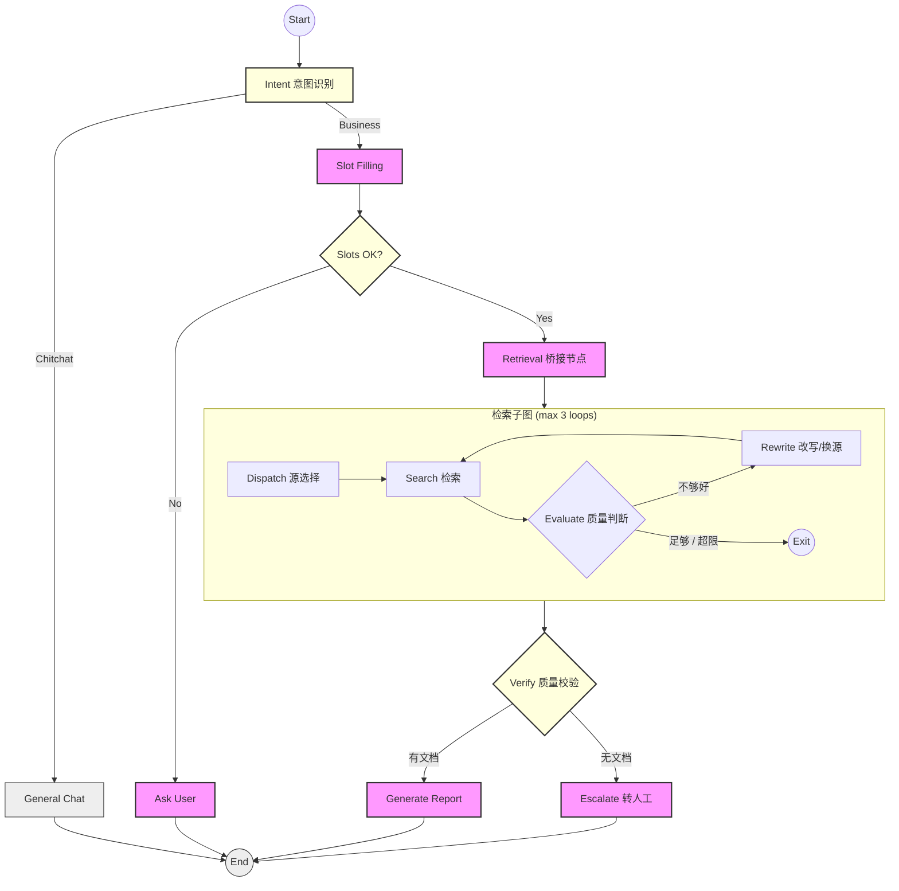

# 工业级 ITS 智能运维编排引擎技术方案 (Implementation Design)

| 文档版本 | 修改日期 | 状态 | 作者 | 变更内容 |
| :--- | :--- | :--- | :--- | :--- |
| v1.0 | 2026-01-28 | 已归档 | 架构师 | 初始版本 |
| v1.1 | 2026-01-28 | 已归档 | 架构师 | 补充错误处理、可观测性、并行执行及持久化优化 |
| v1.2 | 2026-01-28 | 已归档 | 架构师 | 新增功能规格说明书与全量回归测试策略 |
| v1.3 | 2026-01-28 | 已归档 | 架构师 | 补充 LangGraph 节点与边的详细定义及流程图 |
| v1.4 | 2026-01-28 | 已归档 | 架构师 | 新增会话与记忆管理设计 (State-First 理念) |
| v1.5 | 2026-01-29 | 已归档 | 架构师 | 架构解耦优化：严格界定智能助手与知识库微服务边界 |
| v2.0 | 2026-02-23 | **现行有效** | 架构师 | **升级为混合架构：外层显式管道 + 内层检索子图自主循环** |

---

## 1. 核心决策与架构原则 (Core Decision)

经过架构评审，系统采用 **LangGraph** 作为底层的编排框架，严格遵循 **“Agent 做编排，微服务做业务”** 的解耦原则。

### 1.1 架构原则：Hybrid Pipeline + Autonomous SubGraph
*   **外层确定性**: 主图采用显式管道编排（intent → slot → retrieval → verify → report），流程可控、可观测。
*   **内层智能性**: 检索环节嵌入带循环的子图，模型在受控范围内自主决策（改写 query、切换数据源，最多 3 次）。
*   **状态隔离**: 主图 `AgentState` 与子图 `RetrievalSubState` 分离，通过桥接节点映射，互不污染。
*   **状态强一致性**: 采用强类型 State Schema + `operator.add` 追加语义，确保多轮对话上下文不丢失。

---

## 2. 系统功能规格说明书 (Functional Specifications)

### 2.1 核心业务能力
*   **精准技术支持**: 针对电脑维修、软件故障提供 SOP 级别的分步指导。
*   **实时信息聚合**: 结合 MCP 协议获取最新天气、资讯，实现时效性补全。
*   **位置与服务集成**: 集成百度地图能力，提供周边服务站导航及 POI 检索。

---

## 3. LangGraph 节点与边定义 (Graph Nodes & Edges)

### 3.1 主图节点定义 (Main Graph Nodes)

主图包含 **8 个节点**，检索环节由子图封装：

| 节点名称 | 文件 | 职责 (Responsibility) | 输入 (Input) | 输出 (Update) |
| :--- | :--- | :--- | :--- | :--- |
| **node_intent** | `nodes/intent_node.py` | L1/L2 意图分类 | `messages` | `current_intent`, `intent_confidence` |
| **node_slot_filling** | `nodes/slot_filling_node.py` | 语义槽位提取（增量合并） | `current_intent`, `messages`, `slots` | `slots`, `missing_slots` |
| **node_ask_user** | `nodes/ask_user_node.py` | 缺槽位追问（最多 3 轮） | `missing_slots`, `ask_user_count` | `messages`, `ask_user_count` |
| **node_general_chat** | `nodes/general_chat_node.py` | 闲聊回复，引导回业务 | `messages` | `messages` |
| **node_retrieval** | `graph.py` (桥接节点) | 运行检索子图，映射状态 | `current_intent`, `slots`, `messages` | `retrieved_documents` |
| **node_verify** | `nodes/merge_verify_nodes.py` | LLM 质量判断 | `retrieved_documents`, `messages` | `retrieved_documents` (不合格时清空) |
| **node_generate_report** | `nodes/action_nodes.py` | 综合检索结果生成答案 | `retrieved_documents`, `current_intent`, `messages` | `final_report`, `messages` |
| **node_escalate** | `nodes/action_nodes.py` | 转人工客服 | — | `need_human_help`, `messages` |

### 3.1.1 检索子图节点 (Retrieval SubGraph Nodes)

检索子图（`retrieval_subgraph.py`）内含 **4 个节点**，支持自主循环（最多 3 次）：

| 节点名称 | 文件 | 职责 | 输入 | 输出 |
| :--- | :--- | :--- | :--- | :--- |
| **dispatch** | `nodes/retrieval_subgraph_nodes.py` | 意图→数据源映射 | `intent` | `source` (kb/web/local_tools) |
| **search** | 同上 | 执行检索 | `source`, `query`, `slots` | `documents` |
| **evaluate** | 同上 | LLM 判断结果质量 | `documents`, `original_query` | `is_sufficient`, `suggestion`, `loop_count` |
| **rewrite** | 同上 | 改写 query 或切换数据源 | `suggestion`, `source`, `query` | `query`, `source` |

### 3.2 边与路由定义 (Edges & Routing)

**主图路由：**

| 起始节点 | 路由函数 (Router) | 条件与目标 (Conditions -> Target) |
| :--- | :--- | :--- |
| **START** | - | -> `intent` |
| **intent** | `route_intent` | chitchat -> `general_chat`<br>tech_issue/service_station/poi_navigation/search_info -> `slot_filling` |
| **slot_filling** | `route_slot_check` | 有缺失槽位 -> `ask_user`<br>槽位齐全 -> `retrieval` |
| **retrieval** | - (固定边) | -> `verify` |
| **verify** | `route_verify_result` | 有文档 -> `generate_report`<br>无文档 -> `escalate` |
| **general_chat / ask_user / generate_report / escalate** | - | -> `END` |

**检索子图路由：**

| 起始节点 | 路由函数 | 条件与目标 |
| :--- | :--- | :--- |
| **dispatch** | - (固定边) | -> `search` |
| **search** | - (固定边) | -> `evaluate` |
| **evaluate** | `route_evaluate` | is_sufficient=True 或 loop_count≥3 -> `END`<br>否则 -> `rewrite` |
| **rewrite** | - (固定边) | -> `search` (循环) |

### 3.3 状态流转拓扑图 (Mermaid Visualization)



---

## 4. 详细数据结构定义 (State Schema)

### 4.1 主图状态 (AgentState)

```python
class AgentState(TypedDict):
    """核心状态对象 (The Blackboard)"""
    # 基础通信
    messages: Annotated[List[BaseMessage], operator.add]
    # 上下文
    session_id: str
    user_id: str
    trace_id: str
    # 业务状态
    current_intent: Optional[str]   # L2 意图
    intent_confidence: float
    # 槽位管理
    slots: Dict[str, Any]
    missing_slots: List[str]
    ask_user_count: int             # 追问计数（max 3）
    # 检索结果
    retrieved_documents: Annotated[List[Any], operator.add]
    # 结果控制
    need_human_help: bool
    final_report: Optional[Dict[str, Any]]
```

### 4.2 检索子图状态 (RetrievalSubState)

```python
class RetrievalSubState(TypedDict):
    """检索子图内部状态，与主图隔离"""
    query: str              # 当前检索 query（可被 rewrite 改写）
    original_query: str     # 原始用户 query（不变）
    intent: str             # 意图类型
    slots: Dict[str, Any]   # 槽位
    source: str             # 当前数据源: kb / web / local_tools
    documents: List[Dict]   # 本轮检索结果
    is_sufficient: bool     # evaluate 判定结果
    suggestion: str         # pass / retry_same / switch_source
    loop_count: int         # 当前循环次数
    max_retries: int        # 最大循环次数（默认 3）
```