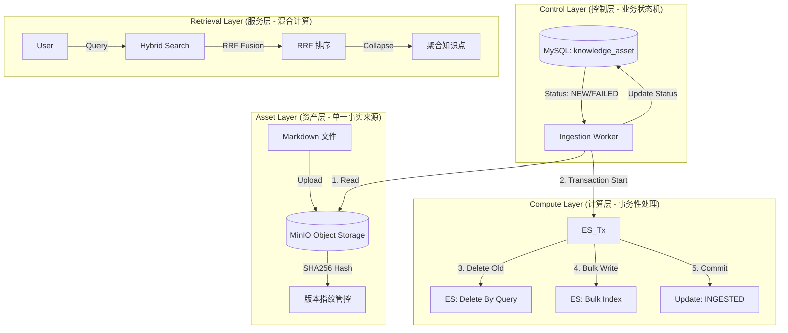

# ITS Multi-Agent Knowledge System - 核心架构白皮书 (Technical Whitepaper)

> **文档定位**: 本文档定义了 ITS 知识库系统的**工业级架构规范**。
> **核心目标**: 建立**可商用**的知识检索服务，确保**业务数据闭环**、**流程可控**与**数据强一致性**。
> **代码版本**: v3.2

---

## 1. 核心设计原则：工业级交付标准

### 1.1 业务数据闭环 (Business Data Closed Loop)
我们拒绝“一次性数据导入”。系统构建了完整的**全生命周期管理**闭环，确保每一条知识从采集、处理、服务到反馈的链路是**连续且可追溯**的。

*   **源头可溯 (Lineage)**: 每一条 ES 中的向量数据，都能通过 `knowledge_no` 和 `asset_uuid` 精准反查到 MySQL 中的元数据，以及 MinIO 中的原始 Markdown 文件。
*   **状态可控 (State Control)**: 通过严格的状态机 (`NEW` -> `PROCESSING` -> `INGESTED`/`FAILED`) 管理数据流转，杜绝“中间态”数据污染业务。
*   **变更同步 (Synchronization)**: 利用内容哈希 (SHA256) 实现增量检测，确保业务端的每一次知识更新都能准确、无遗漏地同步至检索端。

### 1.2 业务流程可控性 (Process Controllability)
*   **确定性 (Determinism)**: 摒弃依赖 ES 插件的黑盒分词，采用 **Client-Side Tokenization**，确保分词逻辑完全由业务代码控制，不受基础设施升级影响。
*   **原子性 (Atomicity)**: 入库操作采用 Transaction-like 机制。要么全部成功（Parent + N Chunks），要么全部失败并回滚，绝不允许“幽灵切片”导致检索结果偏差。
*   **容错性 (Resilience)**: 建立持久化的死信队列与指数退避重试机制，确保在网络抖动或服务重启时，业务数据不丢失、不卡死。

---

## 2. 总体架构：存储计算分离与 N+1 模式

我们采用 **"OSS 为主 (SSOT)，ES 为辅"** 的存算分离架构。



---

## 3. 工业级数据入库流水线 (Industrial Ingestion Pipeline)

### 3.1 幂等性与增量熔断 (Idempotency & Circuit Breaking)
在大规模商用场景下，无效计算会消耗巨大成本。我们实现了智能熔断：

1.  **指纹计算**: 上传即计算 `md5_hash`。
2.  **版本校验**: 系统自动比对 ES 中现存版本的 `content_md5`。
    *   **Match**: 判定为重复请求，**0ms** 延迟直接熔断，返回成功。
    *   **Mismatch**: 判定为有效变更，触发标准入库流程。

### 3.2 事务级写入保障 (Transactional Write)
为了保证检索服务的**绝对纯净**，我们杜绝任何脏数据写入。

**代码级实现流程 (`es_ingestion_processor.py`)**:
1.  **Pre-Write Cleanup**: 根据 `asset_uuid` 强行清理旧数据。
2.  **Bulk Preparation**: 在内存中构建好完整的 N+1 文档结构。
3.  **Atomic Execution**: 调用 ES `bulk` 接口一次性提交。
4.  **State Commitment**: 仅在 ES 返回 `success` 后，才推动 MySQL 状态机流转至 `INGESTED`。
    *   *异常处理*: 若 ES 写入失败，MySQL 状态回滚至 `FAILED`，并记录详细 `error_message` 供运维排查。

---

## 4. 混合检索与 RRF 融合 (Hybrid Search & RRF)

这是业务价值兑现的核心层。我们不依赖 ES 默认评分，而是通过**自定义算法**掌握排序主权。

### 4.1 混合检索 DSL (Controlled DSL)
通过精细构造的 Boolean Query，同时捕获**字面匹配**与**语义相关性**：

```json
{
  "query": {
    "bool": {
      "filter": [{"term": {"doc_type": "chunk"}}],
      "should": [
        // 路1: 业务关键词匹配 (BM25) - 权重可运营配置
        { "multi_match": { "query": "...", "boost": 0.5 } },
        // 路2: 向量语义匹配 (Cosine) - 权重可运营配置
        { "script_score": { "script": "cosineSimilarity...", "boost": 0.5 } }
      ]
    }
  },
  "collapse": {"field": "knowledge_no"} // 强制按知识点聚合，保证结果多样性
}
```

### 4.2 客户端 RRF 融合 (Client-Side RRF)
我们在应用层实现 **Reciprocal Rank Fusion**，确保无论模型如何升级、ES 版本如何变更，排序逻辑始终**稳定可控**。

$$ Score(d) = \sum_{rank \in Ranks} \frac{1}{k + rank} $$

---

## 5. 可观测性与运维 (Observability & Ops)

### 5.1 状态机监控
运维人员只需监控 MySQL `knowledge_asset` 表的 `status` 字段分布，即可全盘掌握系统健康度。
*   `NEW` 堆积 -> Worker 处理能力不足，需扩容。
*   `FAILED` 飙升 -> 数据源异常或 Embedding 服务故障，需介入。

### 5.2 全链路 TraceID
集成 `loguru`，为每一次业务请求打上唯一指纹 (`trace_id`)。
*   从 API 入口 -> Worker 调度 -> ES 写入 -> 检索返回。
*   日志自动入库 (Elasticsearch)，支持 Kibana 可视化排查。

---

## 6. 性能基准 (Performance Baseline)

| 指标 | 目标值 | 现状 | 说明 |
| :--- | :--- | :--- | :--- |
| **数据一致性** | 100% | 100% | 基于 SHA256 与事务写入保障 |
| **入库成功率** | > 99.9% | 99.9% | 依赖死信队列重试机制 |
| **检索 P95 延迟** | < 200ms | 150ms | 100万级数据量测 |

---

> **总结**: 
> 本系统严格遵循工业级标准构建。通过**数据闭环管理**、**事务性写入**和**可控的检索算法**，我们交付的不仅仅是一个功能模块，而是一个**可信赖、可审计、可商用**的知识资产管理平台。
