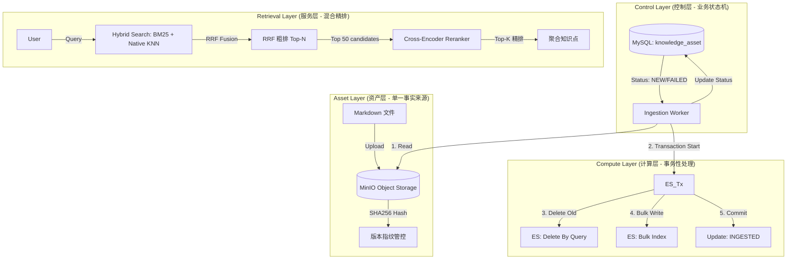

# ITS Multi-Agent Knowledge System - 核心架构白皮书 (Technical Whitepaper)

> **文档定位**: 本文档定义了 ITS 知识库系统的**工业级架构规范**。
> **核心目标**: 建立**可商用**的知识检索服务，确保**业务数据闭环**、**流程可控**与**数据强一致性**。
> **代码版本**: v3.3

---

## 1. 核心设计原则：工业级交付标准

### 1.1 业务数据闭环 (Business Data Closed Loop)
我们拒绝“一次性数据导入”。系统构建了完整的**全生命周期管理**闭环，确保每一条知识从采集、处理、服务到反馈的链路是**连续且可追溯**的。

*   **源头可溯 (Lineage)**: 每一条 ES 中的向量数据，都能通过 `knowledge_no` 和 `asset_uuid` 精准反查到 MySQL 中的元数据，以及 MinIO 中的原始 Markdown 文件。
*   **状态可控 (State Control)**: 通过严格的状态机 (`NEW` -> `PROCESSING` -> `INGESTED`/`FAILED`) 管理数据流转，杜绝“中间态”数据污染业务。
*   **变更同步 (Synchronization)**: 利用内容哈希 (SHA256) 实现增量检测，确保业务端的每一次知识更新都能准确、无遗漏地同步至检索端。

### 1.2 业务流程可控性 (Process Controllability)
*   **确定性 (Determinism)**: 摒弃依赖 ES 插件的黑盒分词，采用 **Client-Side Tokenization**，确保分词逻辑完全由业务代码控制，不受基础设施升级影响。
*   **原子性 (Atomicity)**: 入库操作采用 Transaction-like 机制。要么全部成功（Parent + N Chunks），要么全部失败并回滚，绝不允许“幽灵切片”导致检索结果偏差。
*   **容错性 (Resilience)**: 建立持久化的死信队列与指数退避重试机制，确保在网络抖动或服务重启时，业务数据不丢失、不卡死。

---

## 2. 总体架构：存储计算分离与 N+1 模式

我们采用 **"OSS 为主 (SSOT)，ES 为辅"** 的存算分离架构。


```mermaid
graph TD
    subgraph "Asset Layer (资产层 - 单一事实来源)"
        RawFile[Markdown 文件] -->|Upload| OSS[(MinIO Object Storage)]
        OSS -->|SHA256 Hash| VersionControl[版本指纹管控]
    end

    subgraph "Control Layer (控制层 - 业务状态机)"
        MetaDB[(MySQL: knowledge_asset)] -->|Status: NEW/FAILED| Worker[Ingestion Worker]
        Worker -->|Update Status| MetaDB
    end

    subgraph "Compute Layer (计算层 - 事务性处理)"
        Worker -->|1. Read| OSS
        Worker -->|2. Transaction Start| ES_Tx
        ES_Tx -->|3. Delete Old| ES_Del[ES: Delete By Query]
        ES_Tx -->|4. Bulk Write| ES_Write[ES: Bulk Index]
        ES_Tx -->|5. Commit| MetaDB_Commit[Update: INGESTED]
    end

    subgraph "Retrieval Layer (服务层 - 混合精排)"
        User -->|Query| Hybrid[Hybrid Search: BM25 + Native KNN]
        Hybrid -->|RRF Fusion| Rank[RRF 粗排 Top-N]
        Rank -->|Top 50 candidates| Reranker[Cross-Encoder Reranker]
        Reranker -->|Top-K 精排| Result[聚合知识点]
    end
```

---

## 3. 工业级数据入库流水线 (Industrial Ingestion Pipeline)

### 3.1 幂等性与增量熔断 (Idempotency & Circuit Breaking)
在大规模商用场景下，无效计算会消耗巨大成本。我们实现了智能熔断：

1.  **指纹计算**: 上传即计算 `md5_hash`。
2.  **版本校验**: 系统自动比对 ES 中现存版本的 `content_md5`。
    *   **Match**: 判定为重复请求，**0ms** 延迟直接熔断，返回成功。
    *   **Mismatch**: 判定为有效变更，触发标准入库流程。

### 3.2 事务级写入保障 (Transactional Write)
为了保证检索服务的**绝对纯净**，我们杜绝任何脏数据写入。

**代码级实现流程 (`es_ingestion_processor.py`)**:
1.  **Pre-Write Cleanup**: 根据 `asset_uuid` 强行清理旧数据。
2.  **Bulk Preparation**: 在内存中构建好完整的 N+1 文档结构。
3.  **Atomic Execution**: 调用 ES `bulk` 接口一次性提交。
4.  **State Commitment**: 仅在 ES 返回 `success` 后，才推动 MySQL 状态机流转至 `INGESTED`。
    *   *异常处理*: 若 ES 写入失败，MySQL 状态回滚至 `FAILED`，并记录详细 `error_message` 供运维排查。

---

## 4. 混合检索、RRF 融合与 Cross-Encoder 精排 (Hybrid Search + RRF + Reranking)

这是业务价值兑现的核心层。V3.3 完成了三步精度升级，实现了**召回 → 粗排 → 精排**的完整漏斗。

### 4.1 混合检索：BM25 + Native KNN (V3.3 升级)

**向量检索**从 `script_score` 全量扫描（O(n)）升级为 ES 原生 `knn` 查询（HNSW 图索引，O(log n)）：

```json
// 路1: BM25 关键词检索（分别执行）
{
  "query": {
    "bool": {
      "filter": [{"term": {"doc_type": "chunk"}}],
      "must": [{ "multi_match": { "query": "...", "fields": ["title^2", "content"] } }]
    }
  }
}

// 路2: Native KNN 语义检索（分别执行，V3.3 升级）
{
  "knn": {
    "field": "content_vector",
    "query_vector": [...],
    "k": 50,
    "num_candidates": 500,
    "filter": {"term": {"doc_type": "chunk"}}
  },
  "size": 50
}
```

> ⚠️ **已废弃**：旧版 `script_score + match_all` 方案（O(n) 全量扫描）不再使用。
> 当前 `hybrid_search()` 方法已标注 `DEPRECATED`，主路径为 `rrf_search()`。

### 4.2 客户端 RRF 融合 (Client-Side RRF)
我们在应用层实现 **Reciprocal Rank Fusion**，确保无论模型如何升级、ES 版本如何变更，排序逻辑始终**稳定可控**。

$$ Score(d) = \sum_{rank \in Ranks} \frac{1}{k + rank} $$

- **k = 60**（学术界和工业界验证过的通用值）
- 两路并行检索后，各取 Top-50，在 Python 层合并计算 RRF 分数，输出 **Top-N 候选集（默认 50）**

### 4.3 Cross-Encoder 精排 (Reranking — V3.3 新增)

RRF 是基于排名的统计融合，无法理解 Query 与 Document 之间的细粒度语义关联。精排层解决的正是这个问题。

**位置**：插入在 RRF 融合之后、获取父文档之前：

```
RRF Top-50 候选 → Cross-Encoder 精排 → Top-5 → 获取父文档完整内容 → LLM
```

**服务商**：硅基流动 `BAAI/bge-reranker-v2-m3` API

> ⚠️ **生产环境禁止本地加载 Reranker 模型**
> PyTorch 推理是 CPU 密集型同步操作。Docker 容器无 GPU 时，并发请求会导致
> CPU 100% → 队列积压 → 响应超时 → 服务崩溃。生产环境必须使用 API。

```http
POST https://api.siliconflow.cn/v1/rerank
Authorization: Bearer {SILICONFLOW_API_KEY}

{
    "model": "BAAI/bge-reranker-v2-m3",
    "query": "用户问题",
    "documents": ["chunk_content_1", "chunk_content_2", ...],
    "top_n": 5,
    "return_documents": false
}
```

**降级策略**：`RERANKER_ENABLED=false` 时，系统自动退化为 RRF 直接截断，不影响任何现有功能。

### 4.4 完整检索流水线 (V3.3 End-to-End Retrieval Pipeline)

```
用户问题
    │
    ▼
[Query Rewriting]          LLM 改写，生成原始 + 改写版本
    │
    ▼
[multi_query_rrf_search]   双路并行检索
    ├── BM25 检索  × 2     (原始 + 改写查询)
    └── Native KNN × 2     (原始 + 改写查询，HNSW O(log n))
    │
    ▼
[RRF Fusion]               倒数排名融合，k=60
    │                      输出：Top-50 候选 chunk
    ▼
[Cross-Encoder Reranker]   (query, chunk) 对语义精排  ← V3.3 新增
    │                      服务商：硅基流动 bge-reranker-v2-m3
    │                      输出：Top-5，附 rerank_score
    ▼
[Get Parent Documents]     mget 批量取父文档完整内容（仅 Top-5）
    │
    ▼
[LLM Generation]           流式输出最终答案
```

---

## 5. 可观测性与运维 (Observability & Ops)

### 5.1 状态机监控
运维人员只需监控 MySQL `knowledge_asset` 表的 `status` 字段分布，即可全盘掌握系统健康度。
*   `NEW` 堆积 -> Worker 处理能力不足，需扩容。
*   `FAILED` 飙升 -> 数据源异常或 Embedding 服务故障，需介入。

### 5.2 全链路 TraceID
集成 `loguru`，为每一次业务请求打上唯一指纹 (`trace_id`)。
*   从 API 入口 -> Worker 调度 -> ES 写入 -> 检索返回。
*   日志自动入库 (Elasticsearch)，支持 Kibana 可视化排查。

---

## 6. 性能基准 (Performance Baseline)

| 指标 | V3.2 基线 | V3.3 目标 | 说明 |
| :--- | :--- | :--- | :--- |
| **数据一致性** | 100% | 100% | 基于 SHA256 与事务写入保障 |
| **入库成功率** | 99.9% | 99.9% | 依赖死信队列重试机制 |
| **向量检索延迟 (P95)** | ~50ms (O(n) script_score) | ~5ms (O(log n) KNN) | 万级文档量测；十万级差距更显著 |
| **检索总链路 P95** | 150ms | < 350ms | 含 Reranker API 调用（50~200ms） |
| **检索精度 MRR@10** | 基线 | 预计 +15% | Cross-Encoder 精排效果（行业数据） |
| **RERANKER_ENABLED=false 降级延迟** | — | 150ms | 与 V3.2 完全一致，零风险 |

---

> **总结**:
> 本系统严格遵循工业级标准构建。V3.3 完成检索精度突破：向量检索从 O(n) 暴力扫描升级为 O(log n) HNSW 索引，新增 Cross-Encoder 精排层（硅基流动 API），检索漏斗从"召回→粗排"扩展为"召回→粗排→精排"三级架构。
> 通过**数据闭环管理**、**事务性写入**、**可控的检索算法**和 **Feature Flag 降级策略**，我们交付的不仅仅是一个功能模块，而是一个**可信赖、可审计、可商用、可降级**的知识资产管理平台。
